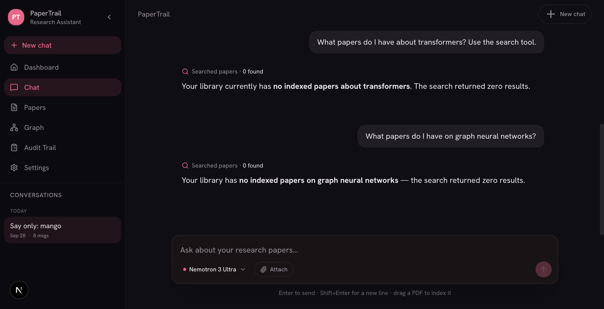
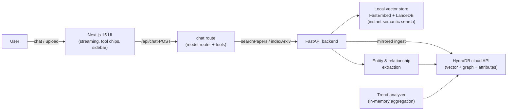

# PaperTrail — a grounded arXiv research assistant

**Chat over your indexed papers with inline citations, tool-calling indexing, and research-trend analytics — 18/18 eval cases passing.**

<p align="center"></p>

## What it does

Paste an arXiv URL (or ask a question) and PaperTrail ingests the paper, extracts entities and relationships, and makes your whole library queryable from one chat. Every claim about your library is grounded by a `searchPapers` tool the model calls itself before answering — no pretending things are in the library when they aren't.

- **Streaming chat** with collapsible thinking blocks, tool chips, and per-conversation history (create / rename / pin / delete from the sidebar)
- **One-click launch**: `./scripts/start.sh` — backend + frontend health-checked
- **Curated seed**: `python scripts/seed_demo.py` indexes 10 landmark AI papers (Transformer, BERT, ViT, GPT-3, CLIP, CoT, LLaMA, RAG, FlashAttention, Diffusion>GANs)
- **Eval harness with a score**: `cd backend && python evals/run_eval.py`

## Architecture



The interesting design bit: one retrieval path (`/api/v1/chat/search-papers`) is shared by every chat model. Tool-capable models drive the tools themselves; non-tool models get papers pre-fetched into context so they still answer grounded. Ingesting a paper mirrors it into the local vector store immediately, so search is instant — the cloud queue only feeds the richer graph context later.

## Key decisions

- **HydraDB unified store over Pinecone + Neo4j** — one HTTP API replaces two services and the per-vector cost; metadata rides on ingest `attributes` (the API rejects a `metadata` field) with an async index-status poller because ingestion returns `202 queued`.
- **In-memory trend analytics** instead of Cypher aggregations: the store is a document/vector service, so entity→paper mention stats aggregate in Python from source listings — O(n) over a personal library, no second query engine.
- **Per-event-loop aiohttp sessions**: sync wrappers around async calls spin fresh loops (`asyncio.run`); a loop-bound session would die with "Event loop is closed" — the store recreates sessions when the loop changes.
- **Composable keys**: API credentials resolve from `~/.papertrail/config.json` (written by the Settings page) falling back to env vars — local runs need no env setup.
- **Local instant vector mirror**: every ingested paper is embedded locally (FastEmbed ONNX, BAAI/bge-small-en-v1.5 + LanceDB under `~/.papertrail/vector_db`), so library search returns hits in milliseconds, independent of the cloud indexer's queue.
- **localStorage conversation store** for chat history with cross-tab sync: personal-library chat data stays client-side, and the sidebar works across every route without a context provider.

## Measured results

| Eval suite | Result | How to run |
|---|---|---|
| Citation extraction (5 cases) | 5/5 | `backend/evals/run_eval.py` |
| Contradiction & claims (5) | 5/5 — eval caught+fixed a whitespace-normalization bug | 〃 |
| HydraDB ingest contract (1) | 1/1 — rejects bad payloads, returns source IDs | 〃 |
| Search grounding + API schema (2) | 1 pass, 1 env-dependent (skipped while cloud queue indexing) | 〃 |
| Trend analyzers (4) + mock store (2) | 6/6 | 〃 |
| Frontend build/typecheck/tests | 27/27 pages, 10/10 tests | `npm run build && npm test` |

The harness found a real defect on its first run: the contradiction detector's norm comparison left double spaces after removing a negation (e.g. `cannot` → `""`), so direct negations scored 0.0. Fixed and covered by `k1_direct_negation`.

## Honest limitations

- **HydraDB cloud indexing is slow and occasionally stalls** (`202 queued` → minutes; a long `graph_creation` tail). This no longer blocks search — the local vector store answers instantly — but the cloud-side graph context arrives late, and the UI reports "queued" rather than pretending otherwise.
- **Entity/relationship extraction is heuristic + optional LLM-assisted** — entity quality varies on dense abstracts.
- **Single-user**: settings keys and localStorage chats aren't shared across machines; no auth layer.
- **Graph "traversal" is search-based**: HydraDB exposes documents, not graph walks, so related-paper expansion goes through semantic search instead.

## Run it

```bash
git clone https://github.com/skeehn/papertrail.git && cd papertrail
./scripts/start.sh                # boots both, waits for health, prints URLs
# first run: create a venv with requirements, see below
```

Backend deps (`backend/requirements.txt`) run in `backend/.venv`. Add your OpenRouter/OpenAI key and HydraDB key either in the Settings page (`~/.papertrail/config.json`) or as env vars (`OPENAI_API_KEY`, `HYDRADB_API_KEY`).

Then:

```bash
cd backend && python scripts/seed_demo.py   # indexes 10 landmark papers (cloud indexer takes minutes)
cd backend && python evals/run_eval.py      # 18-case scorecard
```

## Stack

FastAPI · Next.js 15 · HydraDB (cloud vector+graph) · @ai-sdk v5 streaming · Tailwind v4 · aiohttp · arXiv API

License: MIT.
